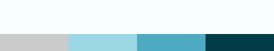
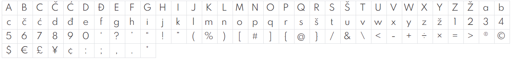

# Description of task.
Design a digital portfolio aimed towards current or future employers to show them my skill set, hobbies and general info about me.

## Employers/Stakeholders.

+ Product info: this is a website for gathering info about me (Matthew Garrett).
+ It needs to be easily accessible i.e. clear colour schemes for people with visual impairments.
+ Must be a simple layout so not to confuse viewers/employers trying to find specific info about me.
+ Must be quick to load such as using sprites instead of whole images, and only using elements where necessary.

## Owners/Me (Matthew Garrett).

+ Needs to be visually appealing to catch the attention of viewers/employers.
+ Must be a professioanl style layout such as no goofy images or text styles.
+ Must be a viable way of gaining employment or increasing chances of employment.
+ Must be cheap to operate (running costs must be low as this will nt have any means of generating income.)

## Developers/Basic requirements.

+ Must be well documented, show what has been done.
+ Must be maintainable.
+ Must be easy to test, make a list of what needs testing.
+ Must have design standards, dont cheap out on specific sections.
+ Must be fast to load.

# Basic Storyboard.
The basic design will be heavily based on the previous design done for the unit. This is due to it already being fully functional and only needing minimal changes to make it relevant to the portfolio. The second benefit is that it will drastically drop the work load down by over 50%. This is due to it having correctly sized and positioned elements, functional nav bar and footer (with links) and a working carousel (just needs images).

# Basic Colour Scheme.
The default colours which were used for Unit 13 will also be used here due to it adding some vibrancy to the website while not being to intense on the eyes. (Colours also match with the original website design.)

# Font Style.
The main font style will be "Spartan Light 300" due to its clean appearance and readability.

# Images to be used.
The types of images to be used within the portfolio are to show me using a range of skills such as fabrication, diagnostics, etc. They will also show my pass times and achievements such as LEGO building or gaining new tools to add to my collection.

# Navigation
| Column FROM / Row TO | Home | About Me | My Hobbies | My Skills | Contact Me |
|--------------------|------|----------|------------|-----------|------------|
| Home               | x    | x        | x          | x         | x          |
| About Me           | x    | x        | x          | x         | x          |
| My Hobbies         | x    | x        | x          | x         | x          |
| My Skills          | x    | x        | x          | x         | x          |
| Contact Me         | x    | x        | x          | x         | x          |

# Sources.
+ Home icon https://www.rawshorts.com/freeicons/wp-content/uploads/2017/01/blue_repicthousebase_1484336386-1.png